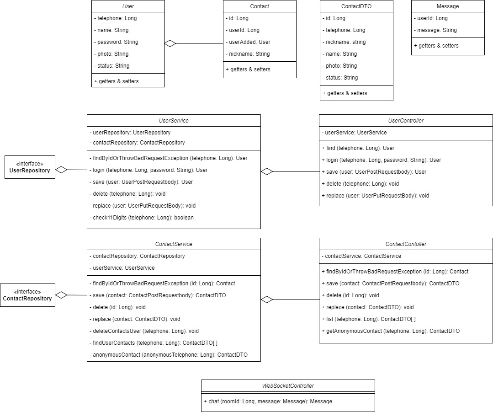

# Angular real time chat
Front-end com o framework Angular de um chat em tempo real utilizando WebSocket. Esta aplicação complementa uma API construída em Java com Spring Boot que está em outro repositório do perfil: [clique aqui!](https://github.com/YuriKevin/Spring_Chat_WebSocket)  

## Funcionamento do sistema: 
[Assista ao vídeo](https://youtu.be/-J83J0FT1GU)

## O que este front-end faz?
- Carrega o usuário e seus contatos através de requisições ao back-end;
- Mantém uma conexão TCP persistente WebSocket com o servidor;
- Possibilita a comunicação em tempo real entre diferentes dispositivos conectados ao back-end;
- Manipula o DOM para: manter sempre a conversa mais recente no topo, organizar as conversas, contatos, mensagens, entre outros;
- Possui um design moderno, minimalista e responsivo para mobile ou desktop;
- Realiza um CRUD completo com o servidor, podendo enviar solicitações para: deletar, inserir, atualizar ou requisitar informações;
- Possui um componente (Warning Componente) exclusivamente dedicado à oferecer feedback para manter o usuário atualizado do que ocorre na aplicação;
- Transforma as imagens dos usuários em strings na base 64 para salvar no servidor;
- Usa recursos importantes do framework Angular, como: manipulação de rotas, uso de diretivas estruturais, uso de Observable, reutilização de um componente como filho de outros componentes e com a possibilidade de um OutPut, importação de bilbiotecas como "HTTP" e "Router", entre outras coisas.

## Como utilizar?
Para utilizar esta aplicação, execute-a na porta 4200 (padrão do angular) abrindo a pasta no terminal e executando o comando "ng serve".  
Não se esqueça de executar o back-end junto! [(back-end)](https://github.com/YuriKevin/Spring_Chat_real_time_WebSocket)

## Diagrama de Classes

### This project was generated with [Angular CLI](https://github.com/angular/angular-cli) version 16.2.1.
